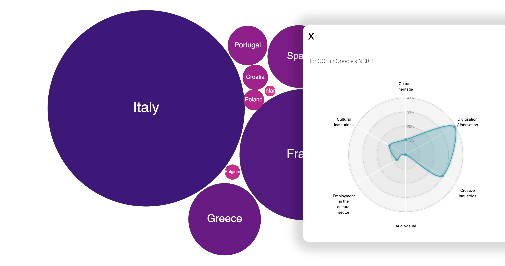

# How is the cultural sector supported through the National Recovery and Resilience Plans?
## Data visualization

The EU Member States submitted National Recovery and Resilience Plans (NRRPs) to the European Commission in order to benefit from financial support needed to mitigate the social and economic impact of the COVID-19 pandemic.

The visualization provides insights into the allocation of funds to the cultural sector from the NRRPs of several Member States.

Technology used:

* JavaScript 
* HTML
* CSS

Libraries used:

* Bootstrap
* D3 library (force-directed bubble chart, radar chart – courtesy of Nadieh Bremer)

The force-directed bubble chart shows the EU Member States’ overall budget for their NRRPs.

The radar chart (which appears on click on each bubble) shows 6 categories of investment from the budget dedicated to the cultural sectors. The radar chart is used to compare the budgets for these categories of investment across the analyzed countries.

 

  

